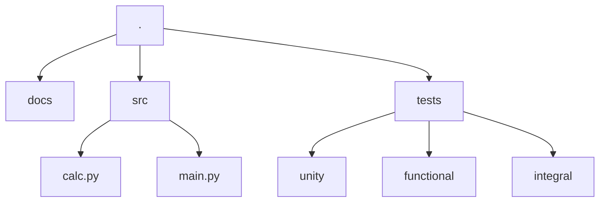

## Project Structure


On `docs` directory, you can find all the documentation of the project. The documentation is made with [mkdocs](https://www.mkdocs.org/). To run the documentation, you must run the command `mkdocs serve` on the root of the project.

On `src` directory, you can find the source code of the project.
- calc.py: contains all the functions of the project
- main.py: contains the cli of the project

On `tests` directory, you can find all the tests of the project. The tests are divided into three categories: 
- unity: tests that test a single function
- functional: tests that test a group of functions
- integral: tests that test the entire application

### calc.py
As this is a template, the calc.py file contains the functions, the main idea is generate provide an exmaple of file that contains the functions of the project that will be used as dependencies for the main.py app.

### main.py
The cli is build using [Typer](https://typer.tiangolo.com/), on this link you can get more information about how to build a cli using this library.

### test
To do tests we are using [pytest](https://docs.pytest.org/). 
The configuration can be found on [pyproject.toml](https://github.com/brunobotelhobr/my-template-python/main/pyproject.toml).

We are using [pytest-cov](https://github.com/pytest-dev/pytest-cov) to generate the coverage report.

```bash
task tests
```

#### Documentation
The documentation is made with [mkdocs](https://www.mkdocs.org/) and staylized with the teme [mkdocs-material](https://squidfunk.github.io/mkdocs-material/).
All the documentation configuration can be found on [mkdocs.yml](https://github.com/brunobotelhobr/my-python-template/blob/main/mkdocs.yml).

#### Code documentation
The Code docuemntation is been made with [mkdocstrings](https://mkdocstrings.github.io/).
So it's automatically generated from the docstrings of the code.

```md
::: modulo
```

To get mode details about docstrings, check at [docstrings @ Google](https://sphinxcontrib-napoleon.readthedocs.io/en/latest/example_google.html).
